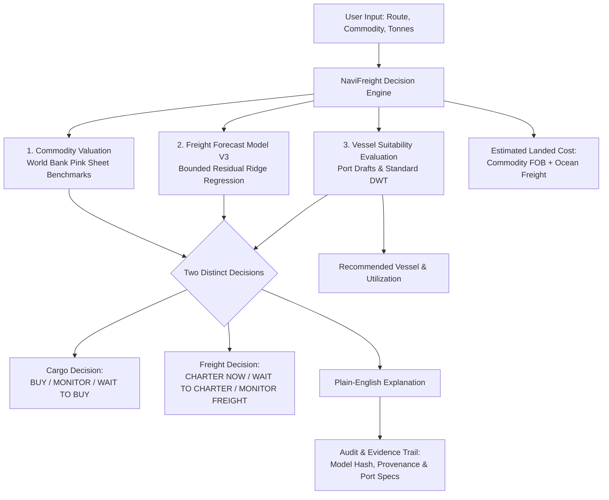

# NaviFreight

> **Problem Statement:**  
> *“Development of an Intelligent Freight Forecasting Model for Optimized Vessel Chartering and Bulk Cargo Procurement from overseas to East Coast of India”*

---

## 1. Overview

**NaviFreight** is a decision-support platform designed for commodity buyers, industrial importers, and freight charterers moving dry-bulk cargo (such as metallurgical coal, thermal coal, and iron ore) from key international supply hubs to ports along the East Coast of India.

In bulk maritime logistics, buyers must solve two interrelated commercial problems:
1. **When to buy the commodity** based on global price levels.
2. **When and how to charter the vessel** based on ocean freight rate trends and physical port constraints.

Traditional logistics platforms merely display raw price feeds, freight indexes, or static vessel tables, forcing operators to manually piece together disparate information. 

**NaviFreight integrates these inputs into an operational decision workflow:**
- **User Inputs:** Cargo commodity, origin port, destination port, and parcel volume (metric tonnes).
- **System Outputs:** Two distinct decisions (**Cargo Decision** and **Freight Decision**), an optimized vessel class recommendation, an estimated delivered landed cost, and a plain-English explanation grounded in transparent audit evidence.

---

## 2. Problem We Are Solving

Bulk cargo procurement and vessel chartering require multi-variable commercial and physical coordination. A charterer importing 150,000 tonnes of metallurgical coal from Australia to India must simultaneously evaluate:

1. **Commodity Valuation:** Is the current FOB price cyclical, elevated, or attractive compared to historical benchmarks?
2. **Freight Market Trajectory:** Are dry-bulk ocean freight rates expected to rise, decline, or hold steady over the coming weeks?
3. **Physical Vessel & Port Constraints:** Does the destination port have sufficient water depth (permissible draft) to berth a fully laden Capesize vessel (18.2m draft), or is it restricted to Panamax (14.5m draft) or shallow riverine draft (e.g., Haldia at 8.0m)?
4. **Delivered Economics:** What is the combined delivered cost per tonne, and what total cash outlay is committed upon fixture?

### The Risk of Disconnected Decisions
- **Purchasing cargo when commodity prices are high** leads to raw material margin loss.
- **Delaying vessel chartering when freight rates are about to spike** destroys procurement cost savings through higher freight outlays.
- **Selecting a vessel class that exceeds destination port draft limits** leads to forced offshore lighterage, high demurrage costs, or rejected port entry.

NaviFreight resolves this by synchronizing commodity procurement valuation, ocean freight forecasting, physical vessel suitability, and delivered landed cost economics into a single operational workflow.

---

## 3. Our Solution

NaviFreight operates on the core principle: **DECISION → EXPLANATION → EVIDENCE**.

### Operational Workflow



1. **Shipment Entry:** The user selects the commodity, origin, destination port, and cargo volume.
2. **Commodity Evaluation:** The system computes historical price percentiles and 3-month momentum against verified benchmark data.
3. **Freight Forecasting:** Model V3 predicts the forward 1-month freight rate trajectory.
4. **Physical Suitability Screening:** Vessel classes (Capesize, Panamax, Supramax) are screened against destination port draft limits and parcel payload capacity.
5. **Two Distinct Decisions:** The system determines the **Cargo Decision** and the **Freight Decision** independently.
6. **Landed Cost Estimation:** Delivered cost per tonne and total cash outlay are calculated.
7. **Transparent Explanation:** Plain-English bullet points explain why the recommendation was generated.
8. **Audit & Evidence:** All data sources, model hashes, and port constraints are open for immediate verification.

---

## 4. What Makes NaviFreight Different?

| Feature / Dimension | Traditional Freight Tools | NaviFreight |
|---|---|---|
| **Primary Output** | Raw prices, market charts, ticker tables | Clear, actionable operational decisions |
| **Commodity + Freight** | Siloed; commodity and shipping viewed separately | Unified into one synchronized recommendation |
| **Vessel Feasibility** | Assumed; manual lookup of port draft limits | Built-in physical draft & deadweight screening |
| **Market Actions** | User must guess when to fix or buy | Explicitly separates Cargo timing from Charter timing |
| **Cost Transparency** | Freight only or commodity only | Formula-backed Estimated Landed Cost calculation |
| **Explainability** | Black-box or manual guesswork | Plain-English reasons explaining every recommendation |
| **Auditability** | Proprietary indices with hidden methodology | Full mathematical, model hash, and data provenance inspection |

> **Key Distinction:**  
> *“NaviFreight does not simply show the market. It interprets market dynamics and physical constraints to help the user decide what to do.”*

---

## 5. Key Features

- **Shipment Parameter Analysis:** Quick selection of trade corridors, commodities, and cargo tonnages with automatic canonical corridor synchronization.
- **Two Distinct Strategic Decisions:**
  - **Cargo Decision:** `BUY CARGO`, `MONITOR CARGO`, or `WAIT TO BUY`.
  - **Freight Decision:** `CHARTER NOW`, `WAIT TO CHARTER`, or `MONITOR FREIGHT`.
- **Infeasible Shipment Identification:** Rejects impossible shipments (e.g., 150,000 mt Capesize to Paradip’s 14.5m draft) with an explicit `NO SUITABLE VESSEL` alert rather than forcing an unrealistic recommendation.
- **Physical Vessel Suitability Screening:** Evaluates Baltic standard classes (Capesize, Panamax, Supramax) against destination port permissible draft, deadweight limits, and commercial utilization.
- **Estimated Landed Cost:** Clear acquisition formula: $\text{Commodity FOB} + \text{Ocean Freight} = \text{Estimated Landed Cost}$ with unit discipline (`USD/mt` for coal, `USD/dmt` for iron ore).
- **Zero-Black-Box Explanations:** 3–4 concise, plain-English reasons for every recommendation.
- **Audit & Evidence Workspace:** Direct verification view displaying Model V3 SHA-256 checksum, training data bounds, official World Bank commodity sources, and port depth citations.
- **Corridor Freight Rate Visualization:** Zero-dependency SVG time-series chart rendering historical Baltic-aligned freight trends (Feb 2024 – Nov 2025).
- **Light Enterprise SaaS UI:** Built with clean white surfaces, subtle borders, and a professional light blue (`#3B82F6`) accent.
- **Concurrency-Safe Telemetry:** SQLite database operating in WAL (Write-Ahead Logging) mode recording inference logs with connection timeout protection.

---

## 6. How the Decision Works

NaviFreight avoids combining cargo and freight into confusing, unnatural phrases. Cargo procurement and vessel chartering operate on separate commercial cycles and are displayed as **two distinct decisions**:

### 1. Cargo Decision
- **`BUY CARGO`**: Commodity benchmark price is historically low/attractive ($\le 35\text{th}$ percentile) with favorable or stabilizing price momentum.
- **`MONITOR CARGO`**: Commodity price is within moderate cyclical bounds ($35\text{th} - 75\text{th}$ percentile).
- **`WAIT TO BUY`**: Commodity benchmark is historically elevated ($\ge 75\text{th}$ percentile) near cyclical peaks.

*Data Source: Authentic World Bank Commodity Markets Monthly Data ("Pink Sheet").*

### 2. Freight Decision
- **`CHARTER NOW`**: Ocean freight rates are forecast to increase, or voyage weather disruption risks warrant securing tonnage immediately.
- **`WAIT TO CHARTER`**: Forward ocean freight rates are forecast to decline, making deferral economically advantageous.
- **`MONITOR FREIGHT`**: Ocean freight rates are forecast to remain steady within normal volatility boundaries.

*Model Source: Model V3 Bounded Residual Ridge Regression.*

### Why the Two Decisions Can Differ
Market conditions for the commodity and the freight route do not always move together. For example:

$$\begin{aligned}
\textbf{CARGO DECISION:} & \quad \text{WAIT TO BUY} \\
\textbf{FREIGHT DECISION:} & \quad \text{CHARTER NOW}
\end{aligned}$$

**Explanation:**  
> *"Cargo prices are high, but freight rates are expected to rise. Wait to buy the cargo, but charter the vessel now."*

This informs the charterer to hold off on finalizing the raw material purchase while booking forward ship capacity to avoid being caught in an imminent freight rate spike.

---

## 7. Freight Forecasting Model (Model V3)

The freight forecasting engine is **Model V3**, a **Bounded Residual Ridge Regression** model designed for robustness, physical plausibility, and resistance to synthetic data artifacts.

### Mathematical Formulation

$$\hat{y}_{t+1} = \max\left(1.0, \, \text{current\_freight}_t + \text{clip}\left(\widehat{\Delta y}, -4.0, 4.0\right)\right)$$

where:
- $\widehat{\Delta y} = \mathbf{w}^T \mathbf{x} + b$ is the predicted 1-month freight rate change (USD/tonne).
- **Linear Ridge Estimator:** $\alpha = 10.0$, fitted using L2 regularization to prevent overfitting on small time-series samples.
- **Defensive Guardrail:** Residual delta is clipped to $[-4.0, +4.0]\text{ USD/t}$ (derived from the 99th percentile physical rate fluctuation observed in training data).
- **Physical Rate Floor:** Rate prediction enforces a strict lower bound ($\ge 1.0\text{ USD/t}$), ensuring freight costs never collapse to negative values.

### 13-Feature Contract
Model V3 strictly enforces an immutable 13-feature inference contract (`cargo_tonnes` is deliberately excluded because freight rates are market-wide USD/tonne prices):

1. `origin` (Categorical: Hay Point, Australia West Coast, Taboneo)
2. `destination` (Categorical: East Coast India)
3. `commodity` (Categorical: Coal, Iron Ore, Thermal Coal)
4. `vessel_type` (Categorical: Capesize, Panamax, Supramax)
5. `bdi` (Baltic Dry Index)
6. `vlsfo_usd_per_tonne` (Very Low Sulphur Fuel Oil bunkering price)
7. `coal_price_usd_per_mt` (Commodity benchmark)
8. `iron_ore_price_usd_per_dmt` (Commodity benchmark)
9. `wind_kmh` (Voyage wind velocity)
10. `wave_height_m` (Significant wave height)
11. `cyclone_risk` (Categorical/ordinal environmental indicator)
12. `weather_delay_days` (Estimated weather routing delay)
13. `current_freight_usd_per_tonne` (Baseline spot rate)

### Model Verification & Provenance
- **Artifact Path:** `freight_forecast_model_v3.joblib`
- **File Size:** `4,163 bytes`
- **Exact SHA-256 Checksum:** `71fbb870bb1f555d73a51ed7d83fb5a877cc4405ce54d1fe18407c9ce37c46a8`
- **Holdout Validation (Out-of-Sample Months 18–22, 25 observations):**
  - **MAE:** $0.4730\text{ USD/t}$
  - **RMSE:** $0.5810\text{ USD/t}$
  - **$R^2$ Score:** $0.9655$
  - **MAPE:** $3.47\%$
  - **Directional Accuracy:** $60.0\%$

---

## 8. Data Used

NaviFreight enforces strict data hygiene. We explicitly distinguish between real external datasets, reference data, and quarantined experimental data.

### Real & Reference Datasets

| Dataset File | Records / Scale | Description & Purpose |
|---|---|---|
| `data/master_freight_training_expanded_v1.csv` | 110 rows | **Primary Model V3 Training Dataset.** 22 consecutive months (`2024-02-01` to `2025-11-01`) of genuine historical observations across 5 canonical trade lanes. |
| `data/commodity_prices_worldbank.csv` | 799 rows | **World Bank Pink Sheet Data.** Monthly commodity price observations through August 2026 for Australian Coal and Iron Ore 62% CFR. |
| `data/port_constraints.csv` | 7 ports | **Hydrographic Port Data.** Permissible drafts and berth constraints for Dhamra (18.0m), Gangavaram (18.5m), Visakhapatnam (18.1m), Krishnapatnam (18.0m), Kamarajar (16.5m), Paradip (14.5m), and Haldia (8.0m). |
| `data/vessel_specs.csv` | 3 classes | **Baltic Exchange Vessel Specifications.** Standard DWT, operational draft, and cargo compatibility for Capesize (182k DWT / 18.2m), Panamax (82.5k DWT / 14.43m), and Supramax (58.3k DWT / 12.8m). |
| `data/baltic_route_specs.csv` | 5 corridors | Standard corridor benchmarks, typical cargo types, and distances for reference. |

### Quarantined Synthetic Dataset Notice
- `data/master_freight_training_synthetic_v2.csv` (1,000 synthetic rows) was generated during early offline experimentation.
- **Audit Rule:** This file is **strictly quarantined and is NOT used** for training production Model V3 or serving user forecasts.

---

## 9. Supported Routes & Prototype Scope

NaviFreight is intentionally designed as a focused hackathon prototype for the high-volume dry-bulk import trade into the East Coast of India. It supports the 5 canonical trade corridors represented in the training distribution:

1. **Australia West Coast → East Coast India** | Iron Ore | Capesize (182,000 DWT)
2. **Hay Point (Queensland) → East Coast India** | Metallurgical Coal | Capesize (182,000 DWT)
3. **Hay Point (Queensland) → East Coast India** | Metallurgical Coal | Panamax (82,500 DWT)
4. **Taboneo (Kalimantan) → East Coast India** | Thermal Coal | Panamax (82,500 DWT)
5. **Taboneo (Kalimantan) → East Coast India** | Thermal Coal | Supramax (58,328 DWT)

*Supported discharge ports include Dhamra, Gangavaram, Visakhapatnam, Krishnapatnam, Kamarajar, Paradip, and Haldia.*

---

## 10. Vessel Optimization & Physical Feasibility

A major differentiator of NaviFreight is that it does not assume any ship can berth anywhere. The vessel suitability service (`backend/services/vessel_service.py`) evaluates candidate vessel classes across three criteria:

1. **Physical Draft Compatibility:**  
   $$\text{Vessel Laden Draft} \le \text{Port Permissible Draft}$$
   *Example:* A standard Capesize vessel has an 18.20m laden draft. It can berth safely at Dhamra (18.00m + high water clearance) or Gangavaram (18.50m), but cannot enter Paradip (14.50m draft limit) fully laden.
2. **Capacity Utilization Fit:**  
   $$\text{Utilization} = \frac{\text{Cargo Tonnes}}{\text{Standard DWT}}$$
   - Below 45%: Rejected due to severe deadfreight costs.
   - Above 105%: Rejected due to physical deadweight overloading.
   - 80%–95%: Optimal commercial fit.
3. **Corridor Viability:** Verifies whether the vessel class is commercially established on the selected route.

### Infeasible Shipment Handling
If a user requests 150,000 tonnes of coal to Paradip, the system screens all candidate classes:
- **Capesize:** Exceeds Paradip's 14.5m draft limit.
- **Panamax:** Exceeds 82,500 DWT max capacity (181.8% utilization).
- **Supramax:** Exceeds 58,328 DWT max capacity (257.2% utilization).

Instead of outputting an impossible freight rate, NaviFreight returns `NO SUITABLE VESSEL`, marks freight and landed cost as *"Not available"*, and instructs the user to reduce parcel volume or select a deep-water port.

---

## 11. Estimated Landed Cost

NaviFreight provides a transparent delivered cost calculation for the procurement team:

$$\text{Estimated Landed Cost} = \text{Commodity Benchmark (FOB)} + \text{Ocean Freight Forecast}$$

$$\text{Total Delivered Outlay} = \text{Estimated Landed Cost} \times \text{Cargo Tonnes}$$

### Strict Unit Conventions
- **Coal / Thermal Coal:** Commodity in `USD/mt`, Freight in `USD/t`, Landed Cost in `USD/mt`.
- **Iron Ore:** Commodity in `USD/dmt` (dry metric tonne), Freight in `USD/t`, Landed Cost in `USD/dmt`.

### Commercial Disclaimer
The landed cost figure is an **operational estimate**. It deliberately excludes port handling tariffs, marine cargo insurance, import customs duties, and demurrage penalties, which vary on a contract-by-contract basis.

---

## 12. System Architecture

```
NaviFreight Architecture
│
├── Frontend (Browser UI)
│   ├── Single-Page Application (HTML5 / Vanilla JavaScript ES Modules)
│   ├── CSS Design System (Custom Tailwind Tokens + Light Blue #3B82F6 Theme)
│   └── Zero-Dependency SVG Charting Engine
│
├── API Layer (FastAPI / Uvicorn)
│   ├── POST /decision/analyze       (Primary Orchestration Endpoint)
│   ├── GET  /model/info             (Model V3 Metadata & Checksum)
│   ├── GET  /analytics/freight-trends (Historical Route Observations)
│   ├── GET  /procurement/valuation  (World Bank Benchmark Valuation)
│   ├── POST /vessel/optimize        (Vessel Suitability Evaluation)
│   └── GET  /health                 (Platform Health Check)
│
├── Decision & Service Layer (Python)
│   ├── decision_service.py          (Orchestrates Procurement, Vessel, and Forecast)
│   ├── procurement_service.py       (Deterministic Benchmark Percentile & Momentum Rules)
│   ├── vessel_service.py            (Multi-Criteria Physical Draft & Capacity Evaluator)
│   ├── landed_cost_service.py       (Delivered Acquisition Cost & Outlay Math)
│   └── forecast_service.py          (Model V3 Pipeline Runner)
│
└── Storage & Data Layer
    ├── freight_forecast_model_v3.joblib (Scikit-Learn Pipeline Artifact)
    ├── SQLite freight.db (WAL Mode Inference Logging & Weather Cache)
    └── data/ (Reference CSVs: Vessel Specs, Port Constraints, World Bank Prices)
```

---

## 13. Technology Stack

| Layer | Technology | Purpose in NaviFreight |
|---|---|---|
| **Backend Framework** | **Python 3.10+ / FastAPI** | Async REST API, route handling, Pydantic data validation |
| **ASGI Server** | **Uvicorn** | High-performance production web server |
| **Machine Learning** | **scikit-learn** | Bounded Residual Ridge Regression pipeline (`Pipeline`, `ColumnTransformer`) |
| **Data Processing** | **Pandas & NumPy** | In-memory CSV querying, dataframes, feature arrays |
| **Model Persistence**| **Joblib** | Serialization and loading of the frozen Model V3 pipeline artifact |
| **Database & Cache** | **SQLite (WAL mode)** | Concurrency-safe local cache for inference logging and weather observations |
| **Frontend UI** | **Vanilla HTML5 & JavaScript** | Responsive, modern web interface with zero framework overhead |
| **Styling** | **Custom CSS & Tailwind (CDN)** | Light enterprise SaaS theme, custom tokens, and `#3B82F6` primary accent |
| **Visualizations** | **Native SVG Engine** | Responsive, zero-dependency time-series charts |

---

## 14. API Documentation

### Primary Endpoint: `POST /decision/analyze`

Executes full end-to-end decision orchestration:

**Request Payload:**
```json
{
  "commodity": "Coal",
  "origin": "Hay Point",
  "destination": "Dhamra",
  "cargo_tonnes": 150000
}
```

**Response Payload (Summary):**
```json
{
  "commodity": "Coal",
  "origin": "Hay Point",
  "destination": "Dhamra",
  "cargo_tonnes": 150000.0,
  "procurement": {
    "signal": "WAIT",
    "benchmark_price_usd_per_mt": 135.20,
    "unit": "USD/mt",
    "percentile": 93.8,
    "momentum_3m_pct": -1.24
  },
  "vessel": {
    "recommended_vessel": "Capesize",
    "status": "OPTIMIZED",
    "predicted_freight_usd_per_tonne": 17.09,
    "estimated_freight_outlay_usd": 2563500.0,
    "suitability_score": 100.0,
    "evaluated_vessels": [...]
  },
  "landed_cost": {
    "commodity_fob_usd": 135.20,
    "ocean_freight_usd_per_tonne": 17.09,
    "estimated_landed_cost_usd": 152.29,
    "estimated_total_landed_outlay_usd": 22843500.0,
    "formula": "Landed Cost = Commodity FOB + Ocean Freight"
  },
  "charter_decision": "CHARTER NOW",
  "overall_strategy": "WAIT FOR CARGO — CHARTER NOW",
  "decision_reasons": [
    "Commodity Valuation (Coal): Signal is WAIT. Benchmark is $135.20 USD/mt (93.8th historical percentile).",
    "Vessel Recommendation: Capesize selected with suitability score 100.0/100 (82.4% capacity utilization, 18.20m draft).",
    "Freight Timing: CHARTER NOW. Forward freight rates are expected to rise.",
    "Delivered Acquisition Cost: Estimated Landed Cost is $152.29 USD/mt."
  ]
}
```

### Auxiliary Endpoints
- **`GET /model/info`**: Returns active model artifact name, algorithm, SHA-256 hash, and feature names.
- **`GET /health`**: Health check returning `{"status": "ok"}`.
- **`GET /analytics/freight-trends`**: Returns historical monthly freight rate observations for a corridor.
- **`GET /procurement/valuation`**: Returns commodity percentile, momentum, and signal.
- **`POST /vessel/optimize`**: Evaluates vessel suitability independently of procurement.

Interactive Swagger documentation is available at **`http://127.0.0.1:8000/docs`**.

---

## 15. Frontend Interface

The NaviFreight user interface consists of **exactly two dedicated workspaces**:

### 1. Cargo Decision (Primary Workspace)
- **Shipment Details:** Input selectors for Commodity, Origin Port, Destination Port, and Parcel Tonnes.
- **Recommendation Hero Card:** Two distinct decision containers:
  - `CARGO DECISION` (`WAIT TO BUY` / `BUY CARGO` / `MONITOR CARGO`)
  - `FREIGHT DECISION` (`CHARTER NOW` / `WAIT TO CHARTER` / `MONITOR FREIGHT`)
  - Natural plain-English explanation sentence underneath.
- **Decision Summary:** 3 cards displaying Commodity Price & Percentile, Expected Freight, and Recommended Vessel.
- **Why?:** 3–4 transparent plain-English bullet points.
- **Estimated Landed Cost:** Visual equation card showing Delivered Cost per tonne and Total Outlay.
- **Vessel Options Table:** Feasibility breakdown for Capesize, Panamax, and Supramax.
- **Freight Rate History:** SVG historical corridor trend chart.

### 2. Audit & Evidence (Verification Workspace)
- **Live Decision Parameters:** Snapshot of current evaluated shipment and active recommendations.
- **Model V3 Verification:** Displays exact algorithm, feature contract, training dataset size, and SHA-256 checksum.
- **Commodity Price Provenance:** Details of the World Bank Pink Sheet benchmark dataset and release dates.
- **Baltic Vessel Reference Specifications:** Table of standard dimensions, DWT, and drafts.
- **Port Hydrographic Limits:** Table of permissible drafts for East Coast Indian ports.

---

## 16. Why This Idea is Strong

1. **Converts Scattered Data into Clear Decisions:** Replaces multi-tab manual research with a single consolidated decision.
2. **Synchronizes Two Distinct Commercial Cycles:** Recognizes that commodity markets and ocean freight markets do not move in lockstep.
3. **Respects Physical Shipping Constraints:** Rejects infeasible vessels based on real port drafts and ship capacities.
4. **Calculates Real Financial Exposure:** Quantifies delivered landed cost and total shipment cash outlay.
5. **Completely Auditable:** Every recommendation is supported by plain-English reasons and traceable provenance.
6. **Built for Real Commercial Operators:** Solves an actual business problem in international bulk maritime trade.

---

## 17. What is New and Different?

NaviFreight’s novelty is **not** claiming an impossibly complex machine learning model. Its value is the **architectural integration of five historically isolated domains into one operational workflow**:

$$\text{Commodity Valuation} + \text{Freight Forecasting} + \text{Vessel Feasibility} + \text{Landed Cost} + \text{Audit Evidence}$$

By linking physical port limits with forward market forecasts, NaviFreight prevents charterers from making mathematically attractive but physically impossible shipping fixtures.

---

## 18. Limitations

To maintain engineering honesty and credibility:
- **Focused Prototype Scope:** Limited to 5 canonical bulk trade corridors to the East Coast of India.
- **Historical Training Window:** Model V3 is trained on 110 real monthly observations (Feb 2024 – Nov 2025).
- **Decision Support, Not Certainty:** Forecasts indicate statistical market trajectories; they do not guarantee future spot fixture rates.
- **Simplified Landed Cost:** Excludes variable voyage-specific costs (marine insurance, canal tolls, demurrage, and port tariffs).
- **Static Reference Data:** Port permissible drafts and vessel specifications are based on official published baselines and require periodic administrative updates when dredging or port expansions occur.

---

## 19. Demo Flow for Evaluators

### Scenario A: Feasible Capesize Fixture (Dhamra)
1. Navigate to **`http://127.0.0.1:8000/`**.
2. Select **Commodity:** `Coal`.
3. Select **Origin Port:** `Hay Point`.
4. Select **Destination Port:** `Dhamra`.
5. Enter **Cargo Volume:** `150,000` tonnes.
6. Click **Analyze Shipment**.
7. Observe the separate decisions:
   - **Cargo Decision:** `WAIT TO BUY` (coal benchmark is at 93.8th historical percentile).
   - **Freight Decision:** `CHARTER NOW` (forward freight is expected to rise).
8. Observe the recommended vessel: **Capesize** (82.4% capacity utilization, 18.0m port draft compatible).
9. Review the **Estimated Landed Cost** ($152.29 USD/mt) and total outlay ($22.8M).
10. Click the **Audit & Evidence** tab to verify the Model V3 SHA-256 checksum and official data provenance.

### Scenario B: Infeasible Draft Limitation (Paradip)
1. Return to the **Cargo Decision** tab.
2. Keep `Coal`, `Hay Point`, and `150,000` tonnes, but change **Destination Port** to **`Paradip`**.
3. Click **Analyze Shipment**.
4. Observe the system behavior:
   - The hero recommendation clearly displays **`NO SUITABLE VESSEL`**.
   - Explanation states: *"This shipment cannot be handled by a suitable vessel for the selected route. Try a smaller cargo volume or another destination port."*
   - Expected Freight and Landed Cost show *"Not available"*.
   - In the Vessel Options table, Capesize is flagged as *Not suitable (Draft 18.2m exceeds 14.5m limit)*, while Panamax and Supramax are flagged as *Overloaded*.

---

## 20. How to Run the Application

### Prerequisites
- Python 3.10 or higher
- Modern web browser (Chrome, Edge, Firefox, Safari)

### Installation & Execution

1. **Clone the repository:**
   ```bash
   git clone https://github.com/junaid693/Freight---bulk-Cargo.git
   cd Freight---bulk-Cargo
   ```

2. **Install Python dependencies:**
   ```bash
   pip install -r backend/requirements.txt
   ```

3. **Initialize the local database (optional, auto-initializes on startup):**
   ```bash
   python -m backend.data.update_data
   ```

4. **Start the NaviFreight server:**
   ```bash
   python -m uvicorn backend.main:app --host 127.0.0.1 --port 8000
   ```

5. **Open the web application:**
   Open your browser and navigate to:
   👉 **`http://127.0.0.1:8000/`**

---

## 21. Testing

The backend includes a comprehensive automated test suite covering all services, business logic, model inference, and edge cases.

### Run All Unit Tests
```bash
python -m unittest discover backend
```

### Verified Test Results
```
Ran 99 tests in 1.850s - OK
- test_decision_service.py:    18/18 PASS (Orchestration, strategy mapping, overrides)
- test_vessel_service.py:      17/17 PASS (Draft checks, deadweight fit, scoring)
- test_procurement_service.py: 11/11 PASS (Percentiles, momentum, valuation signals)
- test_landed_cost_service.py:  6/6  PASS (Delivered cost math, unit conventions)
- test_v3_model.py:             4/4  PASS (Model V3 inference pipeline & guardrails)
- test_suite.py:               42/42 PASS (API endpoints, error handling, telemetry)
- test_concurrency.py:          1/1  PASS (SQLite WAL multi-thread write concurrency)
```
**Total: 99 passed; 0 failed.**

---

## 22. Project Structure

```
Freight---bulk-Cargo/
├── README.md                              # Complete project documentation
├── freight_forecast_model_v3.joblib       # Active production Model V3 artifact
├── train_v3.py                            # Model V3 training & validation script
│
├── backend/                               # Application backend
│   ├── main.py                            # FastAPI routes and static mount
│   ├── schemas.py                         # Pydantic request/response schemas
│   ├── predict.py                         # Model V3 loading and prediction interface
│   ├── requirements.txt                   # Core Python dependencies
│   │
│   ├── services/                          # Business logic & decision layers
│   │   ├── decision_service.py            # Unified decision orchestration engine
│   │   ├── procurement_service.py         # World Bank commodity valuation service
│   │   ├── vessel_service.py              # Vessel suitability & draft optimization
│   │   ├── landed_cost_service.py         # Delivered landed cost calculation
│   │   └── forecast_service.py            # Freight forecast model execution
│   │
│   ├── data/                              # Data access & database
│   │   ├── database.py                    # SQLite WAL schema & inference logger
│   │   └── update_data.py                 # Initial data seeding script
│   │
│   ├── static/                            # Frontend assets
│   │   ├── index.html                     # Single-page UI (Two workspaces)
│   │   ├── css/
│   │   │   └── styles.css                 # Design tokens & light blue styling
│   │   └── js/
│   │       ├── app.js                     # Application controller & UI rendering
│   │       ├── api.js                     # Backend API client
│   │       └── charts.js                  # Zero-dependency SVG charting engine
│   │
│   └── test_*.py                          # Automated test suites (99 tests)
│
└── data/                                  # Verified datasets & reference files
    ├── master_freight_training_expanded_v1.csv  # Genuine Model V3 training data (110 rows)
    ├── commodity_prices_worldbank.csv           # World Bank Pink Sheet commodity data
    ├── port_constraints.csv                     # Indian port permissible drafts
    ├── vessel_specs.csv                         # Baltic Exchange vessel specs
    └── master_freight_training_synthetic_v2.csv # Quarantined synthetic data (unused)
```

---

## 23. Judge Questions & Answers (FAQ)

### What problem are you solving?
We solve the fragmented decision-making process in dry-bulk ocean freight procurement to the East Coast of India. Bulk importers have to juggle commodity valuation, freight forecasts, vessel capacity, and destination port draft limits. NaviFreight combines these into a synchronized operational recommendation.

### Who would use NaviFreight?
Commercial procurement officers, raw material supply chain managers, dry-bulk chartering desks, and trading teams at steel mills, power plants, and industrial trading firms.

### What exactly does NaviFreight predict?
NaviFreight forecasts the 1-month-ahead ocean freight rate (in USD/tonne) for a given trade corridor and vessel class, and predicts the physical suitability of candidate vessel classes for the destination port.

### How is NaviFreight different from a normal freight website?
Normal freight websites show backward-looking index numbers or spot rate tables. NaviFreight is a **decision-support system**: it evaluates commodity market timing, forecasts forward freight, screens physical ship drafts against port limits, and tells the user whether to buy, wait, or charter now.

### Why do you need machine learning?
Ocean freight rates fluctuate based on global macro indicators (BDI), bunker fuel costs (VLSFO), commodity demand, and regional weather factors. A regularized machine learning model captures these multi-variable dynamics and estimates future rate trajectory from current spot levels.

### Why did you choose Ridge Regression?
Ridge Regression ($L_2$ regularization) provides stable, mathematically explainable predictions on small time-series samples. In dry-bulk shipping, datasets have limited monthly observations (e.g., 110 rows across 5 canonical routes). Complex deep neural networks or unconstrained tree ensembles overfit and generate erratic predictions. Bounded Residual Ridge Regression ensures conservative, physically plausible forecasts.

### What data does the model use?
Model V3 uses genuine historical monthly observations combining the Baltic Dry Index (BDI), bunker fuel prices (VLSFO USD/t), World Bank commodity prices (Coal and Iron Ore), environmental indicators (wind, waves, cyclone risk, weather delay days), and current spot freight levels.

### Is your data real?
**Yes.** All training data (`master_freight_training_expanded_v1.csv`) consists of 110 genuine historical monthly observations (Feb 2024 – Nov 2025) aligned with Baltic Exchange benchmark routes. Commodity data comes directly from the official World Bank Pink Sheet workbook (`CMO-Historical-Data-Monthly.xlsx`). Port permissible drafts come from official Indian Port Authority operational handbooks.

### How many freight observations are available?
110 monthly observations across 5 canonical trade lanes (22 consecutive months per lane).

### How accurate is the model?
On out-of-sample holdout testing (Months 18–22, 25 unseen observations), Model V3 achieves:
- **MAE:** $0.47\text{ USD/t}$
- **RMSE:** $0.58\text{ USD/t}$
- **$R^2$ Score:** $0.9655$
- **MAPE:** $3.47\%$
- **Directional Accuracy:** $60.0\%$

### Is the system real-time?
No. NaviFreight is a strategic monthly/periodic planning prototype that uses monthly published benchmark datasets. It is not connected to a live streaming tick-by-tick broker feed.

### Can the system work for every port?
No. This prototype is intentionally scoped to 7 primary bulk discharge ports on the East Coast of India across 5 canonical overseas supply lanes. Expanding to global ports requires ingesting additional hydrographic port handbooks.

### Why does vessel selection matter?
A Capesize vessel carries roughly twice the cargo of a Panamax and offers lower per-tonne freight costs. However, a Capesize requires approximately 18.2m of water depth. Sending a Capesize to a port like Paradip (14.5m draft) or Haldia (8.0m draft) makes berthing impossible, forcing costly offshore lighterage or turning the vessel away.

### What happens if no vessel is suitable?
The system explicitly alerts the user with `NO SUITABLE VESSEL` and explains the physical limitation, setting freight and landed cost to *"Not available"* rather than displaying an invalid rate.

### Why calculate landed cost?
Industrial buyers care about total delivered cost, not just shipping rates or FOB commodity prices in isolation. An attractive cargo price can be wiped out by an expensive freight rate. Landed cost gives the commercial team their true raw material acquisition cost.

### Does the system include port charges, insurance, taxes, etc.?
No. The MVP landed cost formula calculates: $\text{Commodity FOB} + \text{Ocean Freight}$. Local port tariffs, maritime insurance, customs duties, and demurrage vary by counterparty and are intentionally excluded from this prototype.

### Can the model guarantee the freight price?
**No.** Maritime markets are subject to geopolitical, macroeconomic, and meteorological shocks. NaviFreight provides statistical decision support, not financial or commercial guarantees.

### Does NaviFreight replace a human charterer?
**No.** NaviFreight is a decision-support tool. It assists chartering and procurement managers by automating data aggregation and feasibility screening, allowing humans to make faster, better-informed commercial commitments.

### What happens if cargo and freight recommendations disagree?
They frequently disagree, which is a key strength of the platform. If cargo is expensive (`WAIT TO BUY`) but freight rates are surging (`CHARTER NOW`), NaviFreight clearly highlights both, allowing the company to hedge shipping exposure early while delaying commodity purchase commitments.

### What makes this technically challenging?
Harmonizing four fundamentally different data domains into a single sub-second evaluation: continuous ML regression (freight forecasting), deterministic time-series valuation (procurement signals), discrete physical constraints (port draft depth and vessel capacity fit), and delivered acquisition financial math.

### What would you build next?
*See Future Scope below.*

---

## 24. Future Scope

The following items are planned enhancements and are **strictly distinguished from current prototype features**:
- **Live Market Feed Ingestion:** Direct API integration with commercial Baltic Exchange fixtures and live bunker fuel feeds (S&P Global Platts).
- **Expanded Global Trade Corridors:** Coverage for South Africa (Richards Bay), United States (Hampton Roads), and South America (Ponta da Madeira / Tubarão).
- **AIS Vessel Tracking Integration:** Real-time ship positioning to monitor fleet congestion and queue times at East Coast Indian anchorages.
- **Demurrage & Lighterage Modeling:** Estimating weather-related waiting costs and offshore transshipment expenses for draft-restricted ports.
- **Probabilistic Confidence Bands:** Outputting full distribution intervals ($\text{P10} / \text{P50} / \text{P90}$) alongside point forecasts.

---

## 25. Security & Data Honesty

- **Local Execution:** Model V3 inference runs locally via scikit-learn without transmitting proprietary data to external cloud APIs.
- **Database Safety:** SQLite operations utilize parameterized queries and connection timeouts in WAL mode to avoid database locking or injection risks.
- **Secrets Management:** No hardcoded credentials or API keys exist in the repository; environment variables and `.gitignore` protect sensitive local configuration.
- **Data Integrity:** The model artifact hash (`71fbb870bb1f555d73a51ed7d83fb5a877cc4405ce54d1fe18407c9ce37c46a8`) guarantees that the production weights cannot be altered without failing validation tests.

---

## 26. License & Hackathon Attribution

Developed for the bulk freight forecasting and procurement hackathon challenge. Built with standard open-source technologies (FastAPI, Scikit-Learn, Pandas, Uvicorn). All benchmark data sourced from official World Bank and port authority publications.
